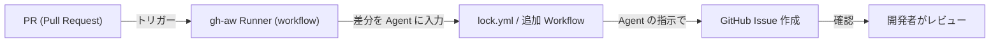

## 🧩 このリポジトリについて

このワークスペースは、GitHub Agentic Workflows（gh-aw）を用いて、PR をトリガーに差分情報を Agent に渡し、Issue としてテスト項目を自動作成する PoC（Proof of Concept）です。

構成、実行手順、動作確認方法、参考リンクをこの README にまとめます。

---

## 📁 主要ディレクトリ構成

| パス | 説明 |
|---|---|
| `test_app/backend/` | Spring Boot ベースのバックエンド（ビルド：Gradle） |
| `test_app/frontend/` | フロントエンド（Vite / Vue、テストに Playwright/Jest 等） |
| `.github/workflows/` | GitHub Actions ワークフロー（gh-aw runner 等） |

詳細なファイル一覧（抜粋）:

| ファイル | 目的 |
|---|---|
| `.github/workflows/gh-aw-runner.yml` | gh-aw runner を起動する Workflow |
| `.github/workflows/lock.yml` | Runner 実行後のロックや次工程を扱う Workflow（例） |
| `test_app/` | アプリ本体（backend/frontend） |

---

## 🔧 動作環境と事前準備

- OS: Linux（開発環境）
- Git, gh CLI（必要な場合は gh-aw 拡張）

ローカルでの最小準備例:

```bash
# gh の拡張（必要なら）
gh extension install github/gh-aw || true

# Git のユーザー設定（初回のみ）
git config --global user.email "you@example.com"
git config --global user.name "yourname"
```

注意: リポジトリ設定で Actions の Workflow permissions はケースにより変わります。

- 自動でワークフローからリポジトリへファイルを commit/push したい場合: "Read and write" が必要です（files/branches の更新）。
- 本リポジトリの現在の運用（`gh aw compile` はローカル手動実行 → 生成ファイルを手動 push）では、ワークフローはリポジトリを書き換えないため `contents: read`（読み取り）で十分です。

※ Issue 作成は `issues: write` が設定されていれば動作します。

---

## 🚀 全体フロー（高レベル）

下記の mermaid 図は、PR から Issue 自動作成までのフローを示します。



具体的な実行例（このリポジトリの実際の実行ログ）:

- PR: https://github.com/cocomomojo/test_mng_aw/pull/16
- runner 実行: https://github.com/cocomomojo/test_mng_aw/actions/runs/22267189912
- lock.yml 実行: https://github.com/cocomomojo/test_mng_aw/actions/runs/22267201644
- 生成された Issue: https://github.com/cocomomojo/test_mng_aw/issues/17

---

## 🛠️ 実際の手順

1. リポジトリをフォーク／クローン

```bash
git clone https://github.com/cocomomojo/test_mng_aw.git
cd test_mng_aw
```

2. ブランチを切って変更を作成し、PR を出す

```bash
git checkout -b feat/example
# ファイル修正
git add .
git commit -m "Add example changes"
git push origin feat/example
# GitHub 上で PR を作成
```

3. PR が作成されると、gh-aw runner Workflow がトリガーされます。

4. Workflow が差分を収集し、Agent（gh-aw）が Issue 用のテスト項目を生成して Issue を作成します。

---

## ✅ 動作確認のチェックリスト

1. PR を作成/更新した後、Actions タブで該当の Workflow（gh-aw-runner）が起動していることを確認する。
2. Runner の実行ログに差分抽出や Agent 実行のログが出ていることを確認する。
3. lock.yml（または関連 Workflow）が続けて実行されることを確認する。
4. 自動生成された Issue（例: #17）が作成され、期待するテスト項目が記載されていることを確認する。

簡易コマンドで確認（例）:

```bash
# Actions 実行状況をローカルから確認するには gh CLI を利用
gh run list --repo cocomomojo/test_mng_aw
gh run view 22267189912 --repo cocomomojo/test_mng_aw
```

---

## 📚 参考リンク

- PR 実例: https://github.com/cocomomojo/test_mng_aw/pull/16
- Runner 実行ログ: https://github.com/cocomomojo/test_mng_aw/actions/runs/22267189912
- lock.yml 実行ログ: https://github.com/cocomomojo/test_mng_aw/actions/runs/22267201644
- 生成された Issue: https://github.com/cocomomojo/test_mng_aw/issues/17

---

## 📝 備考・トラブルシューティング

- Actions の権限設定が不十分だと Issue 作成が失敗します。Organization/Repo の Settings → Actions → General で権限を確認してください。
- ローカルで gh-aw を試す場合、gh の拡張を入れて `gh aw init` を実行して設定を確認してください。

---

## 🧰 gh-aw ローカル環境作成とコンパイル手順

以下はローカルで gh-aw をセットアップし、Agentic ワークフロー定義をコンパイルして `lock.yml` を生成・push するまでの手順例です。

1. gh（GitHub CLI）をインストール（未インストール時）

```bash
# Debian/Ubuntu 例
sudo apt update && sudo apt install -y gh
gh --version
```

2. gh にログイン

```bash
gh auth login
```

3. gh-aw 拡張をインストール

```bash
gh extension install github/gh-aw
```

4. gh-aw を初期化（対話またはリポジトリ指定）

```bash
gh aw init --repo cocomomojo/test_mng_aw
```

5. Agentic ワークフローファイルをコンパイルして `lock.yml` を生成（ローカル手動）

ローカルで `gh aw compile` を実行して `lock.yml` を生成し、自分でコミット・push する運用を推奨します。ワークフロー側（`gh-aw-runner.yml`）は生成済み `lock.yml` の存在を確認する最小動作に簡略化されています。

```bash
# 例: ソースが .github/workflows/pr-test-generator.md の場合
gh aw compile .github/workflows/pr-test-generator.md 
```

注意点:
- ファイル名にスペースやタイプミスがあるとコマンドが失敗します（例: `pr-test-generat or.md` は誤り）。正しいファイル名を指定してください。
- この運用では `gh-aw-runner.yml` の `permissions` は `actions: read` / `contents: read` のままで問題ありません（私がリポジトリの `gh-aw-runner.yml` を簡略化済み）。

6. 生成された `lock.yml` をコミットして push

```bash
# 生成物をコミットして push
git add .github/workflows/pr-test-generator.lock.yml
git commit -m "Add generated lock.yml from gh-aw compile"
git push origin YOUR_BRANCH
```

7. GitHub 上で Actions がトリガーされ、`lock.yml` に基づいて次の Workflow が実行されます。

トラブルシューティングのヒント:
- `gh aw compile` が見つからない／エラーになる場合は gh-aw 拡張のバージョンを確認してください。
- GitHub のパーミッション（Actions → Workflow permissions）を "Read and write" にしていないと Issue の作成やラベル付けが失敗します。
- `gh auth status` で認証状態を確認してください。

---
