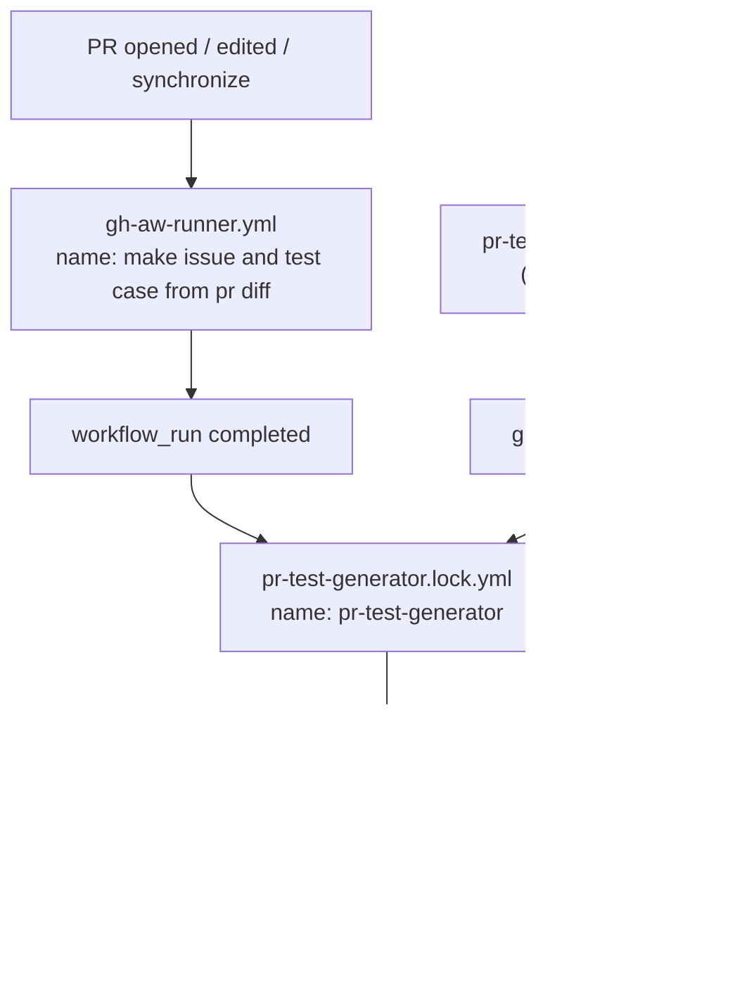

# テスト管理自動化ワークスペース

このリポジトリは、PR 差分をもとにテストチェックリスト Issue を自動生成するための検証用構成です。  
説明は **現状のファイルと挙動** に合わせて記載しています。

## 目的

- PR 更新をトリガーに自動処理を実行する
- PR 内容に応じたテスト観点を Issue 化する
- 生成フローを `gh-aw` ベースで管理する

## 主要構成

- `test_app/backend/` : バックエンド（Spring Boot / Gradle）
- `test_app/frontend/` : フロントエンド（Vue / Vite）とテスト
- `.github/workflows/` : GitHub Actions 定義
- `.github/ISSUE_TEMPLATE/ai-generated-test.yml` : 手動起票時の Issue テンプレート

## Workflow / YAML の関係（Mermaid）


```mermaid
flowchart TD
  A["PR opened / edited / synchronize"] --> B["gh-aw-runner.yml<br/>name: make issue and test case from pr diff"]
  B --> C["workflow_run completed"]
  C --> D["pr-test-generator.lock.yml<br/>name: pr-test-generator"]
  D --> E["safe-outputs: create_issue"]
  E --> F["Issue作成<br/>labels: ai-generated-tests"]

  G["pr-test-generator.md<br/>(ソース定義)"] --> H["gh aw compile"]
  H --> D
```

## 各ファイルの役割

### `/.github/workflows/gh-aw-runner.yml`

- `pull_request`（`opened`, `edited`, `synchronize`）で起動
- ワークフロー名: `make issue and test case from pr diff`
- 現在は最小構成で、主に前段トリガーとして使う

### `/.github/workflows/pr-test-generator.md`

- `gh-aw` のソース定義ファイル
- `workflow_run` を受けて後段処理（Issue 生成）を定義
- 直接実行ファイルではなく、コンパイル対象

### `/.github/workflows/pr-test-generator.lock.yml`

- `pr-test-generator.md` から生成される実行ファイル
- `workflow_run`（対象: `make issue and test case from pr diff`）で起動
- Agent 実行結果から `create_issue` を通じて Issue を作成

### `/.github/ISSUE_TEMPLATE/ai-generated-test.yml`

- 手動で Issue を作る場合のテンプレート
- 生成 Issue と同系統の体裁（Summary / checklist）を維持しやすい

## 運用手順（最小）

1. `pr-test-generator.md` を編集
2. `gh aw compile` を実行して `pr-test-generator.lock.yml` を更新
3. 変更を commit / push
4. PR を作成・更新
5. Actions 実行後、Issue が作成されることを確認

## ローカルコマンド例

```bash
gh aw compile .github/workflows/pr-test-generator.md
git add .github/workflows/pr-test-generator.md .github/workflows/pr-test-generator.lock.yml
git commit -m "chore: update pr-test-generator workflow"
git push
```

## 検証ポイント

- `make issue and test case from pr diff` が PR 更新で起動する
- 続いて `pr-test-generator`（workflow_run）が起動する
- `ai-generated-tests` ラベル付き Issue が作成される

## 実例（匿名化）

以下は実運用での典型例です（URL/番号は匿名化）。

### 例1: UI文言変更のPR

- PR: `PR #XX`（UIテキスト変更）
- 1段目実行: `make issue and test case from pr diff` が `success`
- 2段目実行: `pr-test-generator` が `success`
- 出力: `ai-generated-tests` ラベル付き Issue が1件作成

### 例2: テストコード追加のPR

- PR: `PR #YY`（`test_app/frontend/src/test/...` の更新）
- 1段目実行: `make issue and test case from pr diff` が `success`
- 2段目実行: `pr-test-generator` が `success`
- 出力: テスト観点（回帰/境界値/異常系）を含む Issue が作成

### 実例の見方

1. Actions で PR に紐づく `make issue and test case from pr diff` を確認
2. その完了後に `pr-test-generator` が起動していることを確認
3. Issues で `ai-generated-tests` ラベルを検索し、新規作成を確認

```bash
gh run list --limit 20
gh issue list --label ai-generated-tests --limit 20
```

## 注意事項

- `pr-test-generator.lock.yml` は生成物です。通常は直接編集しません。
- 機密情報（トークン等）は GitHub Secrets で管理してください。
- この README には、リポジトリ所有者名・実行 URL など個人特定につながる情報を記載していません。

## 参考

- GitHub Agentic Workflows 公式ドキュメント
  - https://github.github.com/gh-aw/introduction/overview/
