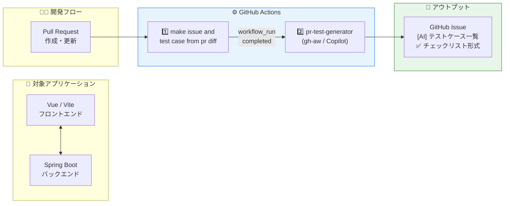
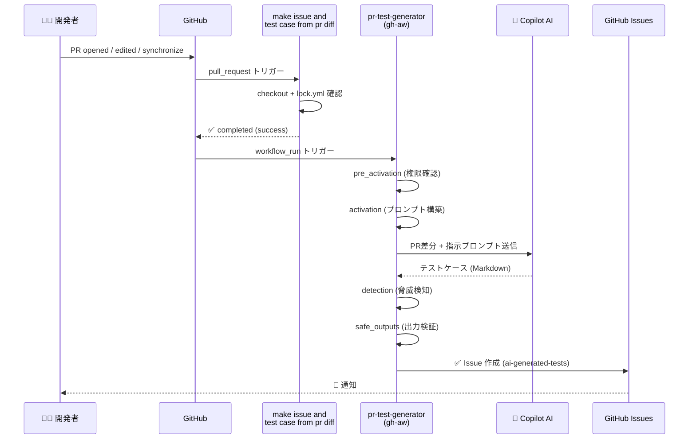
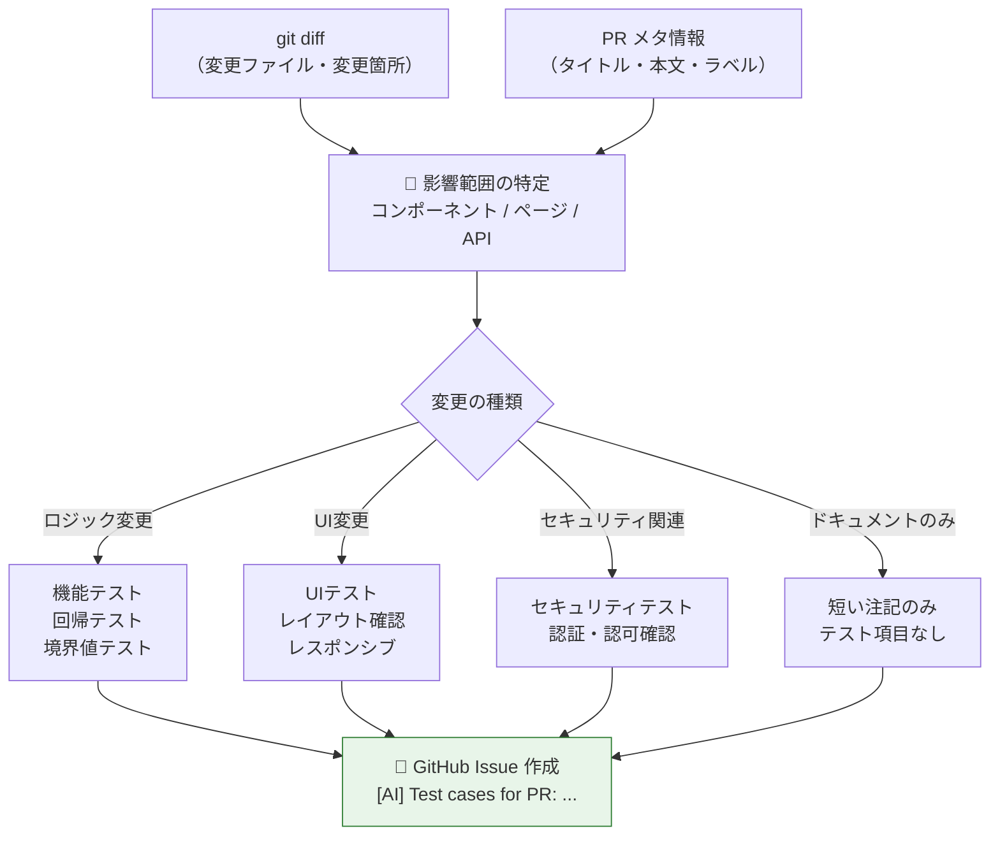
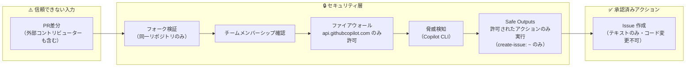

# 🤖 PR差分からテストケースを自動生成する
## GitHub Agentic Workflow による テスト管理自動化

---

## 📋 アジェンダ

1. **背景と課題** — なぜ自動化が必要か
2. **システム概要** — 全体アーキテクチャ
3. **ツールスタック** — 使用技術
4. **ワークフロー詳細** — 仕組みの解説
5. **構成ファイル** — コード例
6. **実行エビデンス** — 実際の動作ログ
7. **生成Issueの実例** — アウトプット確認
8. **まとめ・所感**

---

## 🎯 背景と課題

### テスト管理の典型的な問題

| 課題 | 内容 |
|------|------|
| ⏰ **工数がかかる** | PR内容を読んでテスト観点を洗い出すのに時間がかかる |
| 📉 **抜け漏れリスク** | レビュアーの経験・知識に依存し、品質がブレる |
| 🔄 **繰り返し作業** | 類似PRのたびに同じテストケースを手動で書く |
| 💬 **コミュニケーションコスト** | テスト担当者への引き継ぎ・説明が必要 |

### 💡 解決アプローチ
> **PR の差分（diff）を AI で解析 → テストチェックリスト Issue を自動生成**

---

## 🏗️ システム概要



---

## 🛠️ ツールスタック

| カテゴリ | 技術 | 用途 |
|----------|------|------|
| 🤖 **AI エンジン** | GitHub Copilot CLI (`gh-aw`) v0.48.1 | PR差分からテストケース生成 |
| ⚙️ **CI/CD** | GitHub Actions | ワークフロー実行基盤 |
| 📝 **定義形式** | Markdown + YAML フロントマター | エージェント指示定義 |
| 🔒 **セキュリティ** | Safe Outputs / Threat Detection | AI出力の検証・制御 |
| 🔐 **シークレット管理** | GitHub Secrets | トークン管理 |
| 🖥️ **フロントエンド** | Vue 3 / Vite / Vuetify | 検証対象アプリ |
| ☕ **バックエンド** | Spring Boot / Gradle | 検証対象アプリ |

---

## 📁 ファイル構成

```
.
├── .github/
│   ├── workflows/
│   │   ├── gh-aw-runner.yml          # 1段目: PRトリガー用ワークフロー
│   │   ├── pr-test-generator.md      # gh-aw ソース定義（編集対象）
│   │   └── pr-test-generator.lock.yml # 2段目: コンパイル済み実行ファイル
│   └── ISSUE_TEMPLATE/
│       └── ai-generated-test.yml     # 手動起票用 Issueテンプレート
│
└── test_app/
    ├── frontend/                      # Vue / Vite アプリ
    │   ├── src/
    │   │   ├── components/            # TodoList.vue 等
    │   │   ├── api/                   # APIクライアント
    │   │   └── test/                  # ユニットテスト
    │   └── tests/e2e/                 # E2Eテスト (Playwright)
    └── backend/                       # Spring Boot アプリ
        └── src/                       # Java ソースコード
```

---

## 🔄 ワークフローチェーン詳細



---

## 📄 コード例 ① — エージェント定義ファイル

`pr-test-generator.md` (**編集対象**・人間が読み書きするファイル)

```markdown
---
name: pr-test-generator
description: Generate test cases and issue from PR metadata + diff
engine: copilot
on:
   workflow_run:
      workflows: ["make issue and test case from pr diff"]
      types: [completed]
permissions:
  contents: read
  actions: read
safe-outputs:
   create-issue: ~          # ← Issue作成のみ許可
---

# PR テストケース生成
目的: PR のタイトル・本文・差分から、実行可能なテスト項目を
      Markdown チェックリストとして生成する。
```

> 📝 **ポイント**: YAMLフロントマター + Markdown 自然言語指示で定義。  
> `gh aw compile` コマンドで `.lock.yml` に変換される。

---

## 📄 コード例 ② — AIへの指示（プロンプト部分）

```markdown
手順:
1. PR メタ情報（タイトル、本文、作成者、ラベル）を確認する。
2. `git diff` から影響範囲（コンポーネント、ページ、API）を特定する。
3. 以下の観点でテストを抽出する（該当するもののみ）:
   - 機能 / 回帰 / 境界値 / セキュリティ / パフォーマンス / UI

各テスト項目:
  - **タイトル**（1行）
  - **説明**（1文）
  - **期待結果**（1文）
  - 必要時のみ **手順**（最大3ステップ）

出力形式:
- [ ] **ログイン: 無効なパスワード** — 間違ったパスワードでログインを試行する;
      *期待:* 「認証に失敗しました」と表示される。
```

---

## 📄 コード例 ③ — 1段目ワークフロー (gh-aw-runner.yml)

```yaml
name: make issue and test case from pr diff

on:
  pull_request:
    types: [opened, edited, synchronize]

permissions:
  actions: read
  contents: read
  issues: write
  pull-requests: read

jobs:
  run-agentic:
    runs-on: ubuntu-latest
    steps:
      - uses: actions/checkout@v4
        with:
          fetch-depth: 1

      - name: Using precompiled lock.yml
        run: |
          echo "Using precompiled .github/workflows/lock.yml"
          if [ -f .github/workflows/lock.yml ]; then
            echo "lock.yml present:" && ls -l .github/workflows/lock.yml
          else
            echo "WARNING: lock.yml not found." && exit 0
          fi
```

---

## 📄 コード例 ④ — 2段目ワークフロー（lock.yml 抜粋）

`pr-test-generator.lock.yml`（自動生成・直接編集不可）

```yaml
# ╔══════════════════════════════════╗
# ║  Generated by gh-aw v0.48.1      ║
# ╚══════════════════════════════════╝

name: "pr-test-generator"
on:
  workflow_run:
    types: [completed]
    workflows: ["make issue and test case from pr diff"]

concurrency:
  group: "gh-aw-${{ github.workflow }}"

jobs:
  pre_activation:  # 権限・チームメンバーシップ検証
  activation:      # プロンプト構築・テンプレート補完
  agent:           # Copilot CLI 実行（PR差分 → テストケース生成）
  detection:       # 脅威検知・セキュリティスキャン
  safe_outputs:    # Issue作成（承認済み出力のみ実行）
  conclusion:      # 最終ステータス確定
```

---

## ✅ ワークフロー運用手順

```bash
# ① エージェント定義を編集
vim .github/workflows/pr-test-generator.md

# ② lock.yml にコンパイル
gh aw compile .github/workflows/pr-test-generator.md

# ③ コミット・プッシュ
git add .github/workflows/pr-test-generator.md \
        .github/workflows/pr-test-generator.lock.yml
git commit -m "chore: update pr-test-generator workflow"
git push

# ④ PR を作成・更新するだけで自動実行！
# → Issue が自動作成される
```

```bash
# 確認コマンド
gh run list --limit 20
gh issue list --label ai-generated-tests --limit 20
```

---

## 📊 実行エビデンス ① — ワークフロー実行一覧

> 実際の実行記録（2026-03-07）

| # | ワークフロー名 | ブランチ | ステータス | 実行時刻 (UTC) |
|---|---------------|----------|-----------|----------------|
| 1 | `make issue and test case from pr diff` | test19/workflow-smoke-pr | ✅ success | 07:47:42 |
| 2 | `make issue and test case from pr diff` | test19/workflow-smoke-pr | ✅ success | 07:47:28 |
| 3 | `make issue and test case from pr diff` | test19/workflow-smoke-pr | ✅ success | 07:42:51 |
| 4 | `pr-test-generator` | main | ✅ success | 07:52:18 |
| 5 | `make issue and test case from pr diff` | test18 | ✅ success | 06:45:15 |
| 6 | `pr-test-generator` | main | ✅ success | 06:45:26 |

> 📌 `make issue...` 完了後、自動で `pr-test-generator` が連鎖起動していることを確認

---

## 📊 実行エビデンス ② — ジョブ別タイムライン

> `pr-test-generator` 実行 (Run ID: 22795083608) のジョブ分解

```
07:52:18 ┌─────────────────────────────────┐
         │ pre_activation  (21秒)           │ ✅ チームメンバーシップ確認
07:52:39 ├─────────────────────────────────┤
         │ activation      (24秒)           │ ✅ プロンプト構築・変数補完
07:53:03 ├─────────────────────────────────┤
         │                                  │
         │ agent           (2分16秒)        │ ✅ Copilot CLI 実行
         │ 🤖 PR差分解析 → テストケース生成 │   (Copilot API: 17 requests)
         │                                  │
07:55:19 ├─────────────────────────────────┤
         │ detection       (31秒)           │ ✅ 脅威検知スキャン
07:55:50 ├─────────────────────────────────┤
         │ safe_outputs    (30秒)           │ ✅ Issue 作成実行
07:56:20 ├─────────────────────────────────┤
         │ conclusion      (15秒)           │ ✅ 完了確認
07:56:35 └─────────────────────────────────┘
    合計: 約 4分17秒 (エージェント起動から Issue 作成まで)
```

---

## 📊 実行エビデンス ③ — ファイアウォールログ

`agent` ジョブの Firewall Activity（実際のログより）

```
▼ 17 requests | 17 allowed | 0 blocked | 1 unique domain

| Domain                  | Allowed | Denied |
|-------------------------|---------|--------|
| api.githubcopilot.com   |   17    |    0   |
```

> 🔒 **gh-aw のセキュリティ設計**
> - AIエージェントのネットワークアクセスはファイアウォールで制御
> - 許可されたドメイン（`api.githubcopilot.com`）のみ通信可能
> - すべてのリクエストがログに記録される
> - `safe-outputs` で Issue作成のみを許可（コード変更・秘密漏洩を防止）

---

## 📝 生成 Issue の実例 ① — テストコード追加のPR

**PR内容**: `test_app/frontend/src/test/api/top.test.js` にユニットテスト追加

**自動生成 Issue タイトル**: `[AI] Test cases for PR: test: workflow verification with frontend test update`

```markdown
## Summary
| 項目        | 内容                                      |
|------------|-------------------------------------------|
| PR URL     | (PR #24)                                  |
| Confidence | 高                                        |
| 影響コンポーネント | top.test.js (APIリクエストインターセプター) |
| 変更概要    | requestInterceptor に対する新規ユニットテスト追加 |

> **注記**: specs/README.md への変更はドキュメントのみのためテスト対象外
```

---

## 📝 生成 Issue の実例 ① — テストチェックリスト

```markdown
## Test checklist (draft)

### 機能テスト
- [x] **新規テスト実行: token absent ケース**
      — 追加された it('does not add Authorization header...')
        がエラーなくパスすること;
      *期待:* expect(config.headers.Authorization).toBeUndefined() がグリーン

- [x] **全テストスイート通過**
      — テストファイル追加後も既存テストがすべてパスすること

### 境界値テスト
- [ ] **token: null / undefined / 空文字 の各ケース(要レビュー)**
      *期待:* config.headers.Authorization がすべて undefined

### セキュリティテスト(要レビュー)
- [ ] **未認証リクエストに Authorization ヘッダーが漏れないこと**
```

> 🏷️ ラベル: `ai-generated-tests` が自動付与、作成者: `github-actions[bot]`

---

## 📝 生成 Issue の実例 ② — UI文言変更のPR

**PR内容**: `TodoList.vue` のスナックバーメッセージに句点を追加

```markdown
## Summary
| 項目        | 内容                                          |
|------------|-----------------------------------------------|
| 影響コンポーネント | TodoList.vue — TODO更新時のスナックバー    |
| 変更内容    | 'TODO を更新しました' → 'TODO を更新しました。'  |
| 信頼度      | 高（単一ファイル・1文字の文言変更）              |

## Test checklist (draft)

### UIテスト（画面崩れ）
- [ ] **スナックバー: 句点追加による表示崩れがない（デスクトップ）**
- [ ] **スナックバー: 句点追加による表示崩れがない（モバイル）**

### 境界値テスト
- [ ] **TODO更新: 連続更新時のスナックバー（要レビュー）**
```

---

## 📝 生成 Issue の実例 ③ — ラベル変更のPR

**PR内容**: `v-text-field` のラベルを丁寧な表現に変更

```markdown
## Test checklist (draft)

### 🖥️ UI / 表示
- [ ] ラベル表示確認: 新テキストの表示
- [ ] ラベル表示確認: 旧テキストが残っていないこと
- [ ] レイアウト崩れ確認: PCブラウザ
- [ ] レイアウト崩れ確認: モバイル幅（要レビュー）

### ⚙️ 機能 / 回帰
- [ ] 機能回帰: TODO追加フローの正常動作
- [ ] 機能回帰: 入力フィールド無効状態

### 🎨 インタラクション
- [ ] 浮動ラベル（Floating Label）動作確認
  → Vuetifyの浮動ラベルが正しく上部に移動し、テキストが途切れない
```

---

## 🔍 AIが差分を解釈する仕組み



---

## 💡 実際に使ってみての知見

### ✅ 良かった点

| 観点 | 内容 |
|------|------|
| ⚡ **速度** | PR更新から Issue 作成まで約4〜5分 |
| 🎯 **精度** | 変更の影響範囲を的確に把握（ドキュメントのみは除外） |
| 🔒 **安全性** | Safe Outputs + 脅威検知でAI出力を制御 |
| 📋 **形式統一** | テストケースのフォーマットが一貫している |
| 🏷️ **トレーサビリティ** | IssueにPR URLと実行ランクURLが自動記録 |

### ⚠️ 注意点・改善余地

| 観点 | 内容 |
|------|------|
| 👀 **レビュー必須** | `要レビュー` タグ付き項目は人間の確認が必要 |
| 📊 **信頼度表示** | AIが高/中/低で自己評価（参考指標として活用） |
| 🔑 **Secret管理** | `COPILOT_GITHUB_TOKEN` の適切な管理が必要 |
| 📝 **編集ルール** | `lock.yml` は直接編集不可（必ず `.md` → compile） |

---

## 🔐 セキュリティ設計



---

## 📈 導入効果イメージ

```
【導入前】
  PR作成
    │
    ▼ (手動・数時間〜翌日)
  テスト担当者がPRを読む
    │
    ▼ (経験・知識に依存)
  テスト観点を考える
    │
    ▼
  テストケースをドキュメントに記載
    │
    ▼
  レビュー依頼

【導入後】
  PR作成
    │
    ▼ (自動・約4〜5分)
  [AI] テストケース Issue 自動作成
    │
    ▼ (人間の作業はここから)
  内容確認・追記・実施
```

---

## 🗂️ gh-aw (GitHub Agentic Workflows) とは

| 項目 | 内容 |
|------|------|
| **概要** | GitHub が提供するエージェント型ワークフロー基盤 |
| **バージョン** | v0.48.1（本検証時点） |
| **エンジン** | GitHub Copilot CLI |
| **定義方法** | Markdown + YAMLフロントマター |
| **コンパイル** | `gh aw compile` コマンドで `.lock.yml` に変換 |
| **安全機構** | Safe Outputs, Threat Detection, Firewall |
| **公式ドキュメント** | https://github.github.com/gh-aw/introduction/overview/ |

> 🔑 **キーポイント**: 人間が読める Markdown で AI の「仕事の指示書」を書く。  
> コンパイル後の YAML は自動生成されるため、直接編集不要。

---

## 🎤 パネルディスカッション想定 Q&A

**Q: AIが生成したテストケースはどれくらい信用できる？**  
A: 信頼度は変更の種類・複雑さで変わる。`要レビュー` タグで人間の確認を促す設計。

**Q: 誤ったテストケースが Issue になったら？**  
A: あくまで「ドラフト」。`needs-review` ラベルで未検証を明示。人間がクローズ可。

**Q: フォークからのPRでも動く？**  
A: フォーク検証で `workflow_run` の起動を制御。外部フォークからは起動しない。

**Q: どんなプロジェクトに向いている？**  
A: UIテキスト変更・API仕様変更・テストコード追加など「変更が明確なPR」に特に有効。

**Q: コストは？**  
A: GitHub Copilot のシートライセンスが必要。Actions の実行時間は無料枠内に収まることが多い。

---

## 📌 まとめ

### 🚀 このシステムでできること

```
PR 作成・更新
  ↓ 自動（約4〜5分）
テストケース Issue 作成
  ├── ✅ 影響コンポーネントの自動特定
  ├── ✅ 機能 / 回帰 / 境界値 / セキュリティ 観点の自動分類
  ├── ✅ チェックリスト形式で実施可能な形に整形
  └── ✅ AI生成であることを明示（透明性確保）
```

### 💬 メッセージ

> **「AIはテスト担当者を置き換えない。抜け漏れのないドラフトを即座に渡すアシスタント」**  
> テストケースの「ゼロから1」を自動化し、人間は「1から10」の深掘りに集中できる。

---

## 📎 補足: 実際の実行証跡URL構造

本資料で紹介した実行は以下の情報で追跡可能です：

| 項目 | 値 |
|------|-----|
| 1段目 Run ID | `22795016235` |
| 2段目 Run ID | `22795083608` |
| agent ジョブ ID | `66128325868` |
| 実行日時 | 2026-03-07 07:47〜07:56 (UTC) |
| 生成 Issue 数 | 4件（ai-generated-tests ラベル付き） |
| Copilot API リクエスト数 | 17回（1回の実行あたり） |

> ※ リポジトリURL・Issue URLは本資料では非公開とし、実行数値のみ掲載

---

## 🙏 ありがとうございました

**GitHub Agentic Workflow × テスト管理自動化**

- 📂 定義ファイル: `pr-test-generator.md`（Markdown）
- ⚙️ 実行基盤: GitHub Actions + `gh-aw` v0.48.1
- 🤖 AIエンジン: GitHub Copilot CLI
- 🔒 安全設計: Safe Outputs + Threat Detection + Firewall
- 📝 アウトプット: `ai-generated-tests` ラベル付き GitHub Issue

---

*作成日: 2026-03-30*
*対象リポジトリ: 非公開（検証用）*
